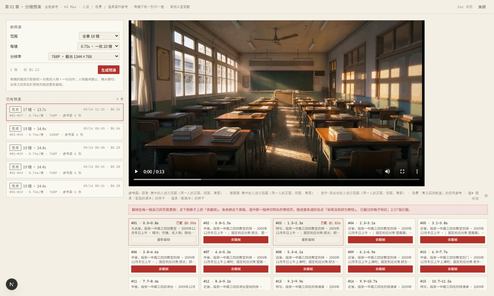
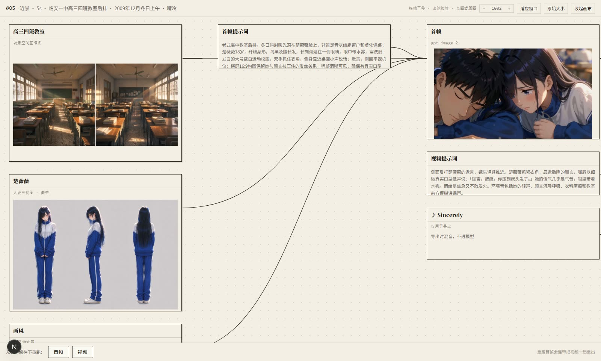
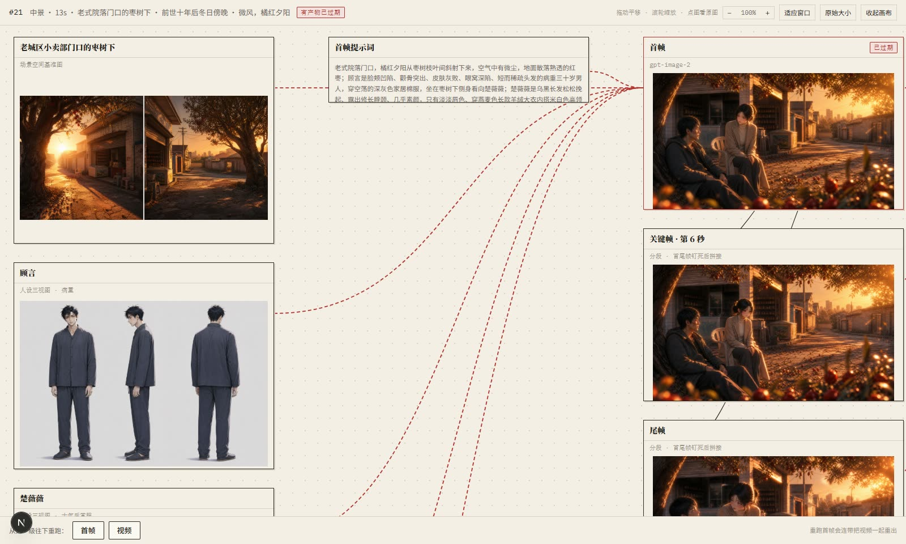
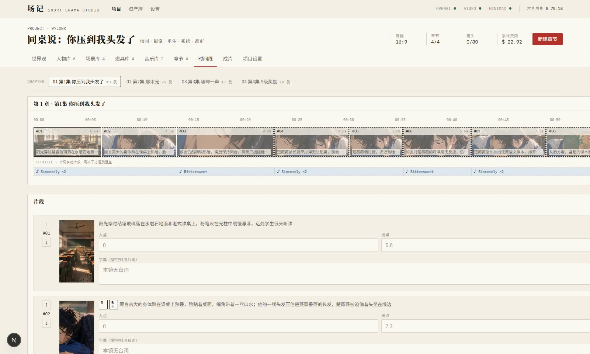

# 墨影 · Inkreel — AI 短剧生产工作台

**展示页 / Landing page → https://sakurahello1.github.io/inkreel/**（中 / EN）· by [updream](https://space.bilibili.com/)

把一章小说变成一集有声动画短剧的单人工作台：**拆镜 → 资产 → 预演截帧 → 出片 → 字幕对齐 → 导出**。
Next.js 15 + Prisma/SQLite，单进程自带任务队列，一台机器就能跑；图和视频走 fal.ai（gpt-image-2.5 + MiniMax H3），也支持 OpenAI 兼容的中转站。

> 墨是小说的字，影是拍出来的片。从墨到影，中间的事都在这里做。

> **接手开发先读 [AGENTS.md](AGENTS.md)**：现状、账户余额与网络状态、说书 / galgame 实现要点、前端约定、坑与待办。本 README 只讲产品与流程。


*分镜工作台：左栏分镜组与镜头缩略图，中栏镜头编辑器（场景 / 景别 / 运镜 / 台词 / 提示词），右栏参考 · 首帧 · 视频三个阶段，首帧页顶上是从预演截帧的进度条。*

---

## 它解决什么问题

用图片模型画首帧、再喂给视频模型出片，是最常见的 AI 短剧流水线。做了几百个镜头之后发现两个绕不过去的问题：

1. **图是图，视频是视频。** 同一套提示词，图片模型画出来的人物和视频模型渲染出来的人物就是两个人；每镜首帧各画一次，进了视频模型再各漂一次，一集下来人物不像同一个。
2. **视频模型的赛璐璐风格不稳定。** 同一条视频里会在 2D 平涂和 3D 渲染之间反复横跳。

所以这个项目走的是**以视频为中心**的路线：

- **预演（Previz）**：把人设三视图、场景图、道具图作为参考，让视频模型自己把一章的镜头快速闪一遍（每镜不到一秒，一条视频装 20 镜）。首帧从这条视频里**人工拖进度条截**——截出来的帧天然就是视频模型自己的世界观，之后出片零漂移。
- **风格写死为动漫 3D**：每一条视频提示词最前面都带同一段风格指令。
- 图片模型退回到只做**资产**（三视图 / 场景 / 道具），gpt-image 画首帧这条路保留为备用。



*预演面板：一批 20 镜 15 秒，参考图按本批实际出场的人自动挑；镜头格子上的「去截帧」直接跳到那一镜的首帧页。*

## 流程

```
小说原文 ──拆镜 Agent──▶ 分镜表（分镜组 / 镜头 / 台词 / 时长 / 首帧与视频提示词）
                              │
资产库（人设三视图 · 场景图 · 道具图 · 画风参考）──▶ 预演：全能参考把整章镜头闪一遍
                              │                          │
                              │                 人工截首帧（也可 gpt-image 画 / 上传 / 用上一镜末帧）
                              │                          │
                              └──────────▶ 出片：首帧 · 首尾帧 · 分段拼接（关键帧）· 过渡镜头
                                                         │
                                     字幕对齐（Whisper 字级时间戳）──▶ 导出（字幕 · BGM · 片尾字卡）
```

### 关键帧与时间线

一镜只有首帧时，结束画面全看模型发挥。可以给镜头加**尾帧**（起止都钉死）或**中间关键帧**（按帧切成若干段，每段一次首尾帧生成，出完 ffmpeg 拼接，接缝是同一张图所以画面连续）。关键帧以本镜首帧为基准由图片模型画，也能上传，尾帧还能直接拿下一镜的首帧（剪辑点无缝）。


*时间线面板：拖圆点改时间点，右侧列出将怎样切段出片——和任务端用的是同一个切段函数，图片顺序与提示词不可能对不上。*

### 版本与血缘

每一次生成都是一个版本：能播、能标注、能采用、能弃。每个产物记录生成那一刻全部输入的指纹，改了上游不用传播，重算一遍就知道谁过期了。



*视频页：版本面板并排比较，「再出一版」可以不替换当前；「展开为画布」把一镜的资产 → 首帧 → 关键帧 → 视频 → 片段摊成节点图。*



### 资产库

人物按「人设 tag」分版本（高中 / 十年后 / 病重…），每个版本一张三视图；场景是两格正反打的空间基准图；道具是概念图。画风参考图只在出资产时用，出片靠文字风格指令。


### 字幕与导出

以前字幕是按字数比例铺满整段，人没开口字幕就出来了。现在导出前先「对齐字幕」：抽人声 → Whisper 字级时间戳 → 按字对到台词句子上，同时把识别出来的话存下来，念错的一眼能看出来。导出用 ffmpeg 拼接、裁切、淡入淡出、烧 ASS 字幕、BGM 连续段落混音、片尾字卡。



### 说书模式

新建项目时选「说书」，就不出视频了：一章拆成一页页 PPT 式的画面，每页一张图、一段说书人旁白、若干句保留原文的对白，配音念出来，字幕跟着走。

```
小说原文 ──拆页 Agent──▶ 页（画面提示词 / 旁白 / 台词 + 语气 + 表情）
                            │
                     出图（gpt-image，带人设与场景参考）
                            │
                     选角：Agent 从 MiniMax 音色库给每个角色和旁白挑 3 个候选、合成试听
                            │
                     ▶ 人工听完逐个确认 ◀ ── 硬闸门，没确认完「配音」按钮不亮
                            │
                     配音（speech-2.8-hd，句级时间戳）──▶ 页视频（ffmpeg：图 + 配音 + 缓推）
                            │
                     时间线 / 导出与短剧共用（字幕直接用 TTS 时间戳，不再 Whisper 对齐）
```

页复用镜头的那一套版本、血缘和导出，所以页视频和普通镜头一样能换版本、能过期、能进时间线。

两种展示方式，在项目设置里切：

- **字幕式**：页图铺满，字幕条留给导出时烧，和短剧一致。
- **对话框式（galgame）**：页图当背景，底部对话框 + 说话人名牌 + 逐字打出（ASS 卡拉 OK，按真实配音时长走），说话的人物以**立绘**站在画面一侧。立绘按「人设 × 表情」生成：gpt-image 以三视图锚身份，birefnet 抠成透明 PNG；人物库每个人设下能逐张看、重画，章节页「立绘」按本章台词自动补齐。对话框在页视频里烧好，导出不再叠字幕。

---

## 运行

```bash
npm install
cp .env.example .env      # 填 FAL_KEY（图 + 视频 + 字幕对齐）或中转站密钥，见文件内注释
npx prisma db push
npm run dev               # http://localhost:3000
```

- 系统里要有 `ffmpeg` / `ffprobe`（带 libass，烧字幕用；Windows 下装 gyan 或 BtbN 的构建即可）
- 数据库与生成文件默认放在**项目目录外**（`.env` 里的 `DATABASE_URL` / `STORAGE_DIR`），否则开发模式下会被文件监听当成源码变更，打断进行中的任务
- **改了 `src/server/jobs/`、`ffmpeg.ts`、`prompts.ts` 要重启 dev server**：任务处理器在导入时注册，热更新不会重新注册

## 供应商

| 用途 | 默认（`IMAGE_PROVIDER=fal` / `VIDEO_PROVIDER=fal`） | 备选（`relay`） |
|---|---|---|
| 三视图 / 场景 / 道具 / 首帧 / 关键帧 | fal `openai/gpt-image-2.5/flare`，推理等级项目级默认、每镜可覆盖 | 中转站 gpt-image-2 |
| 出片（首帧 / 首尾帧 / 分段） | fal `minimax/h3-max-turbo` | 中转站 H3 首尾帧变体 |
| 预演（全能参考） | fal `minimax/h3-max` | 中转站 H3 全能参考变体 |
| 字幕对齐 | fal `fal-ai/whisper`（字级时间戳） | — |
| 拆镜 / 逐镜改写 | 任意 OpenAI 兼容接口 | DeepSeek |
| 音色克隆 | MiniMax | — |

成本记录的是估价（fal 队列接口不回金额），实扣以供应商后台为准。促销期结束后的价格代码里按日期自动切换。

## 目录

```
src/app/                      页面（App Router）。分镜工作台在 projects/[id]/chapters/[cid]/
  ├ storyboard.tsx            三栏外壳与工具条
  ├ preview-pane.tsx          右栏：参考 / 首帧 / 视频，预演截帧器、关键帧块、版本面板
  ├ previz-panel.tsx          预演面板
  ├ timeline-panel.tsx        关键帧时间线
  └ canvas.tsx                节点画布
src/components/ui.tsx         设计系统组件
src/lib/keyframes.ts          分段规则与参考图顺序的唯一事实来源（前后端共用，纯函数）
src/server/actions.ts         Server Actions（薄，只做转发与 revalidate）
src/server/services/          业务逻辑：镜头、章节、预演、字幕、版本、资产
src/server/jobs/              进程内任务队列与各类生成任务（出图 / 出片 / 预演 / 导出）
src/server/providers/         fal / 中转站 / MiniMax 适配层
src/server/prompts.ts         所有提示词模板（风格指令、语言指令、无对白守卫都在这）
src/server/lineage.ts         输入指纹与新鲜度
src/server/ffmpeg.ts          截帧、拼接、字幕、导出
prisma/schema.prisma          数据模型
docs/                         方案与架构说明、截图
deploy/                       Docker + Caddy 部署
scripts/                      一次性运维脚本（带具体项目 id，按需改）
```

## 部署

见 [deploy/README.md](deploy/README.md)：Docker 单容器 + SQLite，Caddy 反代自动 HTTPS，公网必须设 `APP_PASSWORD`。

## 许可

[MIT](LICENSE)
